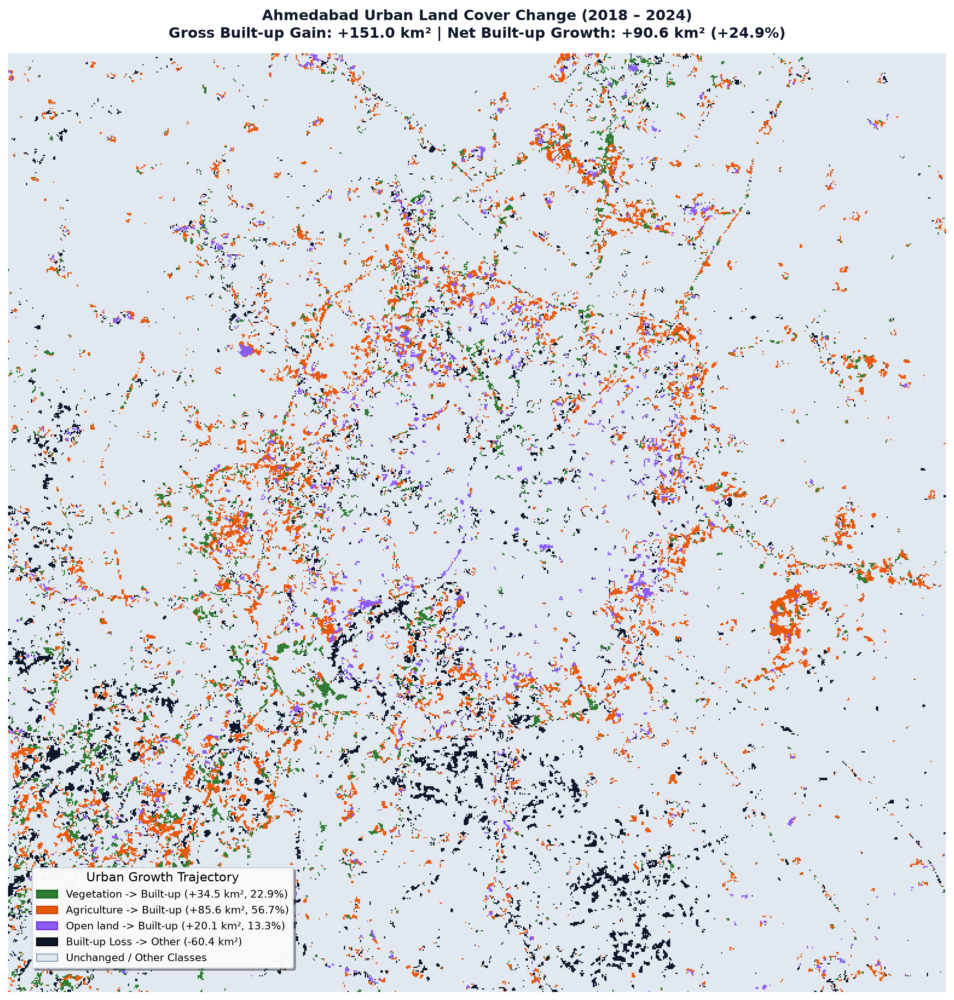

# UrbanPulse 🛰️🏙️

[](https://github.com/husaintrivedi/UrbanPulse/actions/workflows/ci.yml)
[](https://github.com/husaintrivedi/UrbanPulse/actions/workflows/cd.yml)
[](LICENSE)

> **Automated satellite analytics pipeline measuring urban sprawl, land cover transitions, and radial growth dynamics across metropolitan areas using multi-temporal Sentinel-2 Earth observation data and spatial machine learning.**

📖 **Read the Comprehensive Project Report**: [HTML Report](docs/report/index.html) | [PDF Report](docs/report/UrbanPulse_Report.pdf)

---

## 🌐 Live Demo & Interactive App

- **Interactive Web Application**: [https://husaintrivedi.github.io/UrbanPulse/](https://husaintrivedi.github.io/UrbanPulse/)
- **Comprehensive Project Report**: [https://husaintrivedi.github.io/UrbanPulse/report/](https://husaintrivedi.github.io/UrbanPulse/report/)
- **FastAPI Documentation**: `http://localhost:8000/docs` (local deployment)
- **Grafana Monitoring**: `http://localhost:3000` (provisioned with Prometheus metrics)

---

## 📸 Interface & Spatial Visualizations

| Interactive Web Map & Swipe Comparison | 2018–2024 Urban Land Cover Change |
| :---: | :---: |
|  |  |

---

## 📊 Key Results (Automated Pipeline Outputs)

All figures below are extracted directly from pipeline output datasets without manual transcription:

### 1. Ahmedabad (Gujarat, India) — 45 × 45 km AOI (EPSG:32643)

- **Model Accuracy (Pooled RF)**: **65.25%** Overall Accuracy vs. ESA WorldCover ($\kappa = 0.5600$) on held-out spatial blocks.
- **Urban Built-up Growth**: Expanded from **293.55 km²** (2018) to **468.54 km²** (2024), representing a **+59.61%** net growth (+174.99 km²).
- **Land Cover Transitions (2018 → 2024)**: Gross built-up gain of **+175.27 km²** primarily from Agriculture (138.83 km²) and Open Land (31.78 km²); gross built-up loss restricted to **0.28 km²** (loss/gain ratio: 0.16%).
- **Radial Dispersion & Entropy**: Core ($0\text{–}6\text{ km}$) built-up share decreased from **31.87%** to **22.92%**, while peripheral share ($>12\text{ km}$) increased from **19.55%** to **30.94%**. Shannon spatial entropy rose from **0.9036** to **0.9469**.

| Metric | 2018 | 2019 | 2020 | 2021 | 2022 | 2023 | 2024 |
| :--- | :---: | :---: | :---: | :---: | :---: | :---: | :---: |
| **Clean Built-up (km²)** | 293.55 | 368.85 | 384.51 | 414.07 | 441.91 | 474.54 | 468.54 |
| **Raw Built-up (km²)** | 428.67 | 320.38 | 421.06 | 413.61 | 423.91 | 504.42 | 474.02 |
| **Shannon Entropy ($H_n$)** | 0.9036 | 0.9229 | 0.9282 | 0.9354 | 0.9423 | 0.9477 | 0.9469 |

### 2. Pune (Maharashtra, India) — 45 × 45 km AOI (EPSG:32643)

- **Model Accuracy (Pooled RF)**: **69.83%** Overall Accuracy vs. ESA WorldCover ($\kappa = 0.5898$) on held-out spatial blocks.
- **Urban Built-up Growth**: Expanded from **231.25 km²** (2018) to **334.82 km²** (2024), representing a **+44.79%** net growth (+103.57 km²).
- **Land Cover Transitions (2018 → 2024)**: Gross built-up gain of **+103.57 km²** primarily from Agriculture (58.94 km²), Open Land (25.13 km²), and Vegetation (18.66 km²); gross built-up loss is **0.00 km²**.
- **Radial Dispersion & Entropy**: Core ($0\text{–}6\text{ km}$) built-up share decreased from **35.79%** to **26.63%**, while peripheral share ($>12\text{ km}$) surged from **27.18%** to **36.31%**. Shannon spatial entropy rose from **0.8841** to **0.9377**.

| Metric | 2018 | 2019 | 2020 | 2021 | 2022 | 2023 | 2024 |
| :--- | :---: | :---: | :---: | :---: | :---: | :---: | :---: |
| **Clean Built-up (km²)** | 231.25 | 288.66 | 309.70 | 327.91 | 330.40 | 330.40 | 334.82 |
| **Raw Built-up (km²)** | 358.94 | 338.41 | 354.12 | 344.82 | 300.99 | 302.26 | 328.79 |
| **Shannon Entropy ($H_n$)** | 0.8841 | 0.9069 | 0.9161 | 0.9234 | 0.9304 | 0.9348 | 0.9377 |

---

## ⚡ Quickstart

Start the entire local application stack (Web frontend, FastAPI backend, and PostGIS database) with Docker Compose:

```bash
# Clone the repository
git clone https://github.com/husaintrivedi/UrbanPulse.git
cd UrbanPulse

# Spin up services
make up
```

- 🖥️ **Web Dashboard**: [http://localhost:8080/](http://localhost:8080/)
- 📖 **API Docs**: [http://localhost:8000/docs](http://localhost:8000/docs)
- 📊 **Monitoring Stack**: `docker compose --profile monitoring up -d` (Grafana at `http://localhost:3000`, admin/admin)

### Run Pipeline & Generate Reports:
```bash
# Execute end-to-end pipeline for any city
python -m pipeline.run_city --city pune

# Generate HTML report and PDF export
make report
make report-pdf
```

---

## 📁 Project Tree

```
UrbanPulse/
├── configs/                     # City YAML configurations (bbox, dry-season dates, classes)
├── pipeline/                    # Earth Observation & ML Pipeline
│   ├── build_composite.py       # SCL cloud-masked median compositing & radiometric calibration
│   ├── train_classifier.py      # Spatial-block Random Forest model training
│   ├── temporal_cleanup.py      # Majority rule & urban persistence smoothing
│   ├── change_detection.py      # Land cover transition matrix & trajectories
│   ├── ring_analysis.py         # Concentric radial distance density profiling
│   ├── sprawl_metrics.py        # Shannon entropy & sprawl velocity computation
│   ├── quality_gate.py          # Data quality gate validator
│   ├── generate_report.py       # Professional self-contained HTML report generator
│   ├── export_report_pdf.py     # Playwright Chromium headless PDF exporter
│   └── run_city.py              # City pipeline orchestrator
├── api/                         # FastAPI Geospatial Backend (FastAPI, PostGIS queries, /metrics)
├── web/                         # MapLibre GL JS + Chart.js Dashboard (static CDN bundle)
├── db/                          # PostgreSQL 16 + PostGIS 3.4 spatial schemas & migrations
├── infra/                       # Infrastructure as Code (Terraform, Ansible, k3s manifests)
├── monitoring/                  # Observability (Prometheus alerts, Grafana dashboards)
├── docs/                        # Architecture & Technical Documentation
│   ├── report/                  # Generated HTML & PDF reports
│   └── engineering-decisions.md # Rationale and trade-offs
├── tests/                       # Automated Pytest suite
├── Makefile                     # Developer and automation workflows
└── pyproject.toml               # Python package configuration
```

---

## 🏙️ How to Add a New City

UrbanPulse requires **zero code changes** to onboard a new metropolitan area:

1. Create `configs/<city_name>.yaml`:
   ```yaml
   city:
     name: Hyderabad
     state: Telangana
     country: India
   spatial:
     bbox: [78.2000, 17.2000, 78.6500, 17.6000] # ~45x45 km bounding envelope
     crs: EPSG:4326
     center_lat: 17.3850
     center_lon: 78.4867
     buffered_distance_km: 8.0
     aoi_size_km: 45.0
   temporal:
     analysis_years:
       start_year: 2018
       end_year: 2024
     dry_season:
       start_month: 11
       end_month: 2
       start_day: 11-01
       end_day: 02-28
   ```
2. Execute the pipeline:
   ```bash
   python -m pipeline.run_city --city hyderabad
   ```
3. The new city immediately populates the web app, PostGIS database, and documentation reports.

---

## ⚠️ Limitations

- accuracy is agreement with ESA WorldCover, not field-verified ground truth;
- Sentinel-2 covers 2017 onward only;
- dry-season composites confuse fallow farmland with built-up land;
- the model is not transferable across sensors;
- the persistence rule forces non-decreasing built-up area and is a documented assumption;
- 10-60 m resolution limits small features.

---

## 📜 License & Contributions

- **License**: Released under the [MIT License](LICENSE).
- **Contributing**: Please review [CONTRIBUTING.md](docs/CONTRIBUTING.md) for code formatting, tests, and pull request guidelines.
