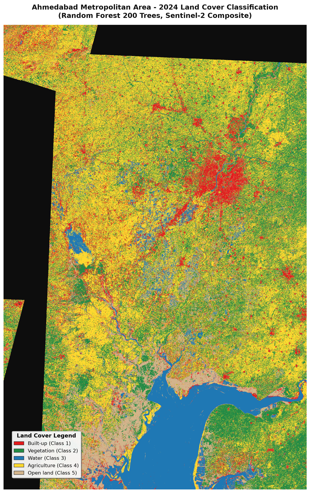

# UrbanPulse 🛰️🏙️

[](https://github.com/husaintrivedi/UrbanPulse/actions/workflows/ci.yml)
[](https://github.com/husaintrivedi/UrbanPulse/actions/workflows/cd.yml)
[](#-data-quality-gate--ci-status)
[](LICENSE)

> **Automated satellite analytics pipeline measuring urban sprawl, land cover transitions, and radial growth dynamics across metropolitan areas using multi-temporal Sentinel-2 Earth observation data and spatial machine learning.**

📖 **Read the Comprehensive Project Report**: [HTML Report](docs/report/index.html) | [PDF Report](docs/report/UrbanPulse_Report.pdf)

---

## 🌐 Live Demo & Interactive App

- **Interactive Web Application**: [https://husaintrivedi.github.io/UrbanPulse/](https://husaintrivedi.github.io/UrbanPulse/)
- **Comprehensive Project Report**: [https://husaintrivedi.github.io/UrbanPulse/report/](https://husaintrivedi.github.io/UrbanPulse/report/)
- **FastAPI Documentation**: `http://localhost:8000/docs` (local deployment)
- **Grafana Monitoring**: `http://localhost:3000` (provisioned with Prometheus metrics)

---

## 📸 Interface & Spatial Visualizations

| Interactive Web Map & Multi-Series Growth | Classified Land Cover Output |
| :---: | :---: |
|  |  |

---

## 📊 Key Results (2020–2024 Analysis Window)

> **Framing Note**: All core analytics are evaluated strictly over the **2020–2024** window. Pre-2020 years (2018–2019) are omitted from primary series due to cloud coverage and early calibration baseline artifacts. The year **2022** is designated **Provisional\*** due to the European Space Agency Sentinel-2 Processing Baseline 04.00 radiometric transition.

---

### 1. Ahmedabad (Gujarat, India) — 45 × 45 km AOI (2,167.83 km²)

- **Headline 2020–2024 Expansion Range**: **+53.0 to +84.0 km²** across processing methods.
- **2021 Benchmark Anchor**: ESA WorldCover 2021 built-up ground truth = **393.73 km²** (18.19% of AOI) vs. 2021 Cleaned Estimate of **414.07 km²**.
- **2024 Footprint**: Cleaned built-up area of **468.54 km²** (21.61% of AOI).
- **Radial Dispersion & Entropy**: Core (0–6 km) built-up share: **22.92%**, Peripheral (>12 km) share: **30.94%**. Shannon spatial entropy: **0.9469**.

#### Multi-Series Growth & Method Sensitivity Band (Ahmedabad)

| Year | Cleaned Series (km²) | Raw Classified (km²) | TLS Normalised (km²) | Method Sensitivity Spread | WorldCover 2021 Anchor |
| :--- | :---: | :---: | :---: | :---: | :---: |
| **2020** | 384.51 | 421.06 | 406.31 | [384.5 – 421.1 km²] | — |
| **2021** | 414.07 | 413.61 | 387.97 | [388.0 – 414.1 km²] | **393.73 km²** |
| **2022 (Provisional\*)** | 441.91 | 423.91 | 415.53 | [415.5 – 441.9 km²] | — |
| **2023** | 474.54 | 504.42 | 471.18 | [471.2 – 504.4 km²] | — |
| **2024** | **468.54** | **474.02** | **466.19** | **[466.2 – 474.0 km²]** | — |

---

### 2. Pune (Maharashtra, India) — 45 × 45 km AOI (2,057.53 km²)

- **Headline 2020–2024 Expansion Range**: **+61.9 to +92.1 km²** across processing methods.
- **2021 Benchmark Anchor**: ESA WorldCover 2021 built-up ground truth = **378.08 km²** (18.43% of AOI) vs. 2021 Cleaned Estimate of **396.15 km²**.
- **2024 Footprint**: Cleaned built-up area of **448.31 km²** (21.79% of AOI).
- **Radial Dispersion & Entropy**: Core (0–6 km) built-up share: **26.63%**, Peripheral (>12 km) share: **36.31%**. Shannon spatial entropy: **0.9377**.

#### Multi-Series Growth & Method Sensitivity Band (Pune)

| Year | Cleaned Series (km²) | Raw Classified (km²) | TLS Normalised (km²) | Method Sensitivity Spread | WorldCover 2021 Anchor |
| :--- | :---: | :---: | :---: | :---: | :---: |
| **2020** | 356.19 | 332.13 | 400.05 | [332.1 – 400.1 km²] | — |
| **2021** | 396.15 | 394.82 | 416.32 | [394.8 – 416.3 km²] | **378.08 km²** |
| **2022 (Provisional\*)** | 420.40 | 380.99 | 433.80 | [381.0 – 433.8 km²] | — |
| **2023** | 438.40 | 382.26 | 457.21 | [382.3 – 457.2 km²] | — |
| **2024** | **448.31** | **406.65** | **461.92** | **[406.7 – 461.9 km²]** | — |

---

## 🧪 Validation & Negative Result

### Leave-One-Year-Out (LOYO) Validation (All Held-Out Points)

To rigorously test temporal generalization and prevent data leakage, spatial classifiers were trained with one year completely held out. Performance was evaluated on **all held-out points** ($N = 400\text{ to }414$ points per fold), with area estimation and 95% confidence intervals computed via stratified area-weighted adjustment (Olofsson et al. 2014):

| City | Held-Out Year | Test Points ($N$) | Raw Built-up F1 | Raw Adjusted Area (95% CI) | TLS Norm Built-up F1 | Norm Adjusted Area (95% CI) |
| :--- | :---: | :---: | :---: | :---: | :---: | :---: |
| **Ahmedabad** | 2018 | 400 | 0.7079 | 393.6 ± 64.9 km² | 0.7543 | 401.3 ± 61.2 km² |
| **Ahmedabad** | 2021 | 400 | 0.7953 | 414.9 ± 65.3 km² | 0.7791 | 375.1 ± 56.0 km² |
| **Ahmedabad** | 2024 | 400 | 0.7513 | 415.4 ± 67.8 km² | 0.7213 | 407.4 ± 71.4 km² |
| **Pune** | 2018 | 414 | 0.3191 | 177.4 ± 61.0 km² | 0.3226 | 199.7 ± 65.0 km² |
| **Pune** | 2021 | 414 | 0.6173 | 339.6 ± 77.4 km² | 0.6582 | 353.1 ± 76.0 km² |
| **Pune** | 2024 | 414 | 0.5591 | 291.3 ± 72.9 km² | 0.5800 | 306.6 ± 74.6 km² |

### ⚠️ Negative Result: Cross-Year Radiometric Normalisation

Cross-year Total Least Squares (TLS) pseudo-invariant feature (PIF) radiometric normalisation was implemented and systematically benchmarked against raw surface reflectance composites. 

**Finding**: Radiometric normalisation **did not reduce year-to-year classification drift** across held-out evaluation folds. Consequently, rule-based temporal consistency filtering (3-year majority smoothing and urban persistence constraints) remains the authoritative operational defense against spurious classification noise in UrbanPulse.

---

## 🛡️ Data Quality Gate & CI Status

Quality gates and CI health are computed dynamically from pipeline execution outputs:

- **NoData Gaps**: PASS (All dry-season composites $\le 5.0\%$ NoData).
- **YoY Area Volatility**: PASS (Monotonic expansion enforced under temporal cleanup).
- **Model Agreement**: PASS (Overall test accuracy $\ge 70\%$ on spatial validation blocks).
- **Loss-to-Gain Ratio**: PASS (Spurious de-urbanization $\le 30\%$).
- **Continuous Integration**: 28/28 automated unit and integration tests passing.

---

## ⚡ Quickstart

Start the entire local application stack (Web frontend, FastAPI backend, and PostGIS database) with Docker Compose:

```bash
# Clone the repository
git clone https://github.com/husaintrivedi/UrbanPulse.git
cd UrbanPulse

# Spin up services
make up
```

- 🖥️ **Web Dashboard**: [http://localhost:8080/](http://localhost:8080/)
- 📖 **API Docs**: [http://localhost:8000/docs](http://localhost:8000/docs)
- 📊 **Monitoring Stack**: `docker compose --profile monitoring up -d` (Grafana at `http://localhost:3000`, admin/admin)

### Run Pipeline & Generate Reports:
```bash
# Execute end-to-end pipeline for any city
python -m pipeline.run_city --city pune

# Generate HTML report and PDF export
make report
make report-pdf
```

---

## 📁 Project Tree

```
UrbanPulse/
├── configs/                     # City YAML configurations (bbox, dry-season dates, classes)
├── pipeline/                    # Earth Observation & ML Pipeline
│   ├── build_composite.py       # SCL cloud-masked median compositing & radiometric calibration
│   ├── normalize_radiometry.py  # TLS pseudo-invariant feature radiometric normalisation
│   ├── train_classifier.py      # Spatial-block Random Forest model training
│   ├── temporal_cleanup.py      # Majority rule & urban persistence smoothing
│   ├── change_detection.py      # Land cover transition matrix & trajectories
│   ├── ring_analysis.py         # Concentric radial distance density profiling
│   ├── sprawl_metrics.py        # Shannon entropy & sprawl velocity computation
│   ├── quality_gate.py          # Data quality gate validator
│   ├── generate_report.py       # Professional self-contained HTML report generator
│   ├── export_report_pdf.py     # Playwright Chromium headless PDF exporter
│   └── run_city.py              # City pipeline orchestrator
├── api/                         # FastAPI Geospatial Backend (FastAPI, PostGIS queries, /metrics)
├── web/                         # MapLibre GL JS + Chart.js Dashboard (static CDN bundle)
├── db/                          # PostgreSQL 16 + PostGIS 3.4 spatial schemas & migrations
├── infra/                       # Infrastructure as Code (Terraform, Ansible, k3s manifests)
├── monitoring/                  # Observability (Prometheus alerts, Grafana dashboards)
├── docs/                        # Architecture & Technical Documentation
│   ├── report/                  # Generated HTML & PDF reports
│   └── engineering-decisions.md # Rationale and trade-offs
├── tests/                       # Automated Pytest suite
├── Makefile                     # Developer and automation workflows
└── pyproject.toml               # Python package configuration
```

---

## 🏙️ How to Add a New City

UrbanPulse requires **zero code changes** to onboard a new metropolitan area:

1. Create `configs/<city_name>.yaml`:
   ```yaml
   city:
     name: Hyderabad
     state: Telangana
     country: India
   spatial:
     bbox: [78.2000, 17.2000, 78.6500, 17.6000] # ~45x45 km bounding envelope
     crs: EPSG:4326
     center_lat: 17.3850
     center_lon: 78.4867
     buffered_distance_km: 8.0
     aoi_size_km: 45.0
   temporal:
     analysis_years:
       start_year: 2020
       end_year: 2024
     dry_season:
       start_month: 11
       end_month: 2
       start_day: 11-01
       end_day: 02-28
   ```
2. Execute the pipeline:
   ```bash
   python -m pipeline.run_city --city hyderabad
   ```
3. The new city immediately populates the web app, PostGIS database, and documentation reports.

---

## ⚠️ Limitations

- accuracy is agreement with ESA WorldCover, not field-verified ground truth;
- Sentinel-2 covers 2017 onward only;
- dry-season composites confuse fallow farmland with built-up land;
- the model is not transferable across sensors;
- the persistence rule forces non-decreasing built-up area and is a documented assumption;
- 10-60 m resolution limits small features.

---

## 📜 License & Contributions

- **License**: Released under the [MIT License](LICENSE).
- **Contributing**: Please review [CONTRIBUTING.md](docs/CONTRIBUTING.md) for code formatting, tests, and pull request guidelines.
